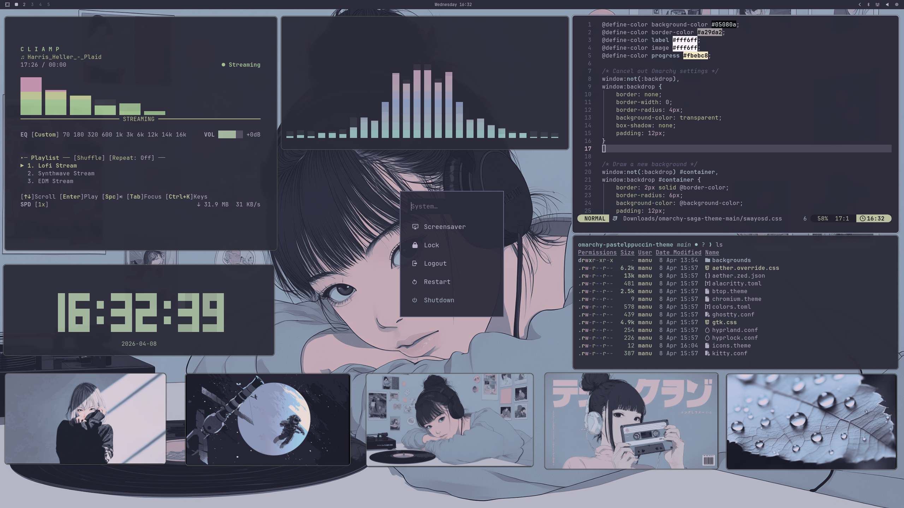

# PASTELPPUCCIN
PASTELPPUCCIN, Omarchy theme - inspired by the iconic Catppuccin palette.

# Installation

To install this theme, simply use the omarchy-theme-install command:

```bash
omarchy-theme-install https://github.com/imanubdesigner/omarchy-pastelppuccin-theme.git
```



#### Recommendations for 3rd-Party App Theming

Using Bypass Theme-Hook script for GTK, Vesktop, Steam, Spotify etc [LINK](https://github.com/imbypass/omarchy-theme-hook)
