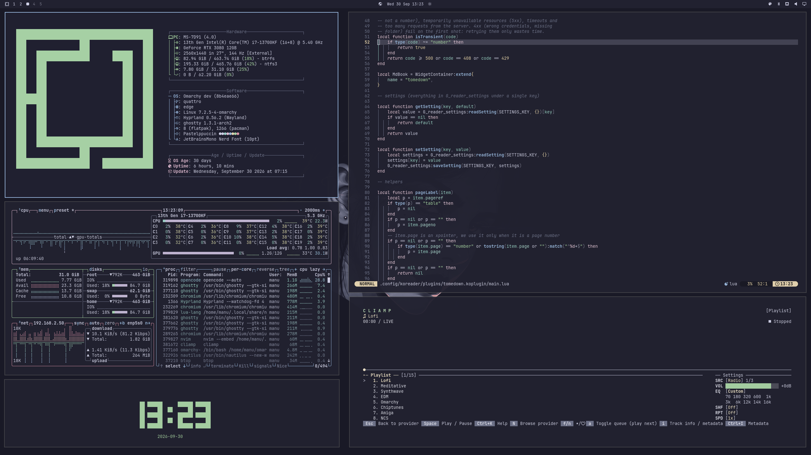
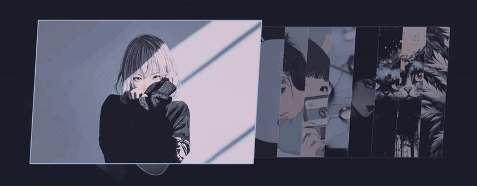

# Pastelppuccin

**Catppuccin Mocha, softened.**
A dusty-pastel Omarchy theme: ink-blue backgrounds, lavender text, and colors
drawn straight from its wallpapers.


<p align="center">
  
</p>

---

## 🖼️ Wallpapers

These are the wallpapers I picked for you — drop them into
`~/.config/omarchy/backgrounds/`. Want more Catppuccin wallpapers? Take a look
at **[Wallppuccin](#-wallppuccin)**.


<p align="center">
  
</p>

---

## 🌿 Wallppuccin

Looking for more wallpapers in the same spirit? **[Wallppuccin](https://github.com/imanubdesigner/wallppuccin)**
is my curated collection of wallpapers converted to the Catppuccin Mocha
palette. Drop any of them into `~/.config/omarchy/backgrounds/` and they will
sit right at home with this theme.


<p align="center">
  <video src="https://github.com/user-attachments/assets/8abf66a1-a4e9-4521-91e2-495723c4a67e" width="420" controls muted loop playsinline></video>
</p>


---

## Installation

```bash
omarchy theme install https://github.com/imanubdesigner/omarchy-pastelppuccin-theme
```

Then pick **Pastelppuccin** from *Style > Theme* in the Omarchy menu.

## Palette

Everything is generated from a single `colors.toml`. It keeps the structure of
Catppuccin Mocha, with softer saturation and hues matched to the wallpapers.

| | Name | Hex |
| --- | --- | --- |
|  | Background | `#212130` |
|  | Foreground | `#cfd0e6` |
|  | Accent / Blue | `#9bb9de` |
|  | Pink | `#e0bdd3` |
|  | Red | `#dc96aa` |
|  | Yellow | `#e7d6b1` |
|  | Green | `#a9d3a6` |
|  | Teal | `#9bd0c7` |

Icons use **Yaru-purple**.

## Credits

- Palette inspired by [Catppuccin](https://github.com/catppuccin/catppuccin).
- Wallpaper artwork from [Wallhaven](https://wallhaven.cc), recolored to fit.
- Built for [Omarchy](https://omarchy.org).

Released under the [MIT License](LICENSE).
